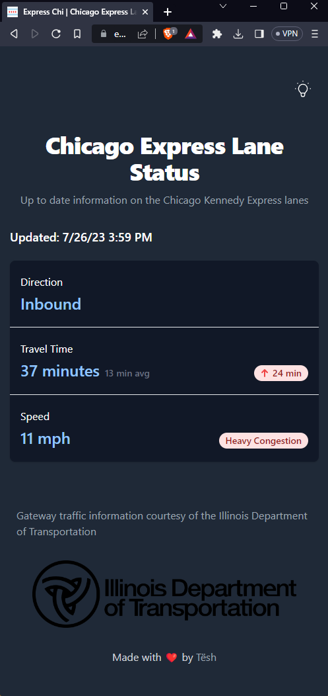
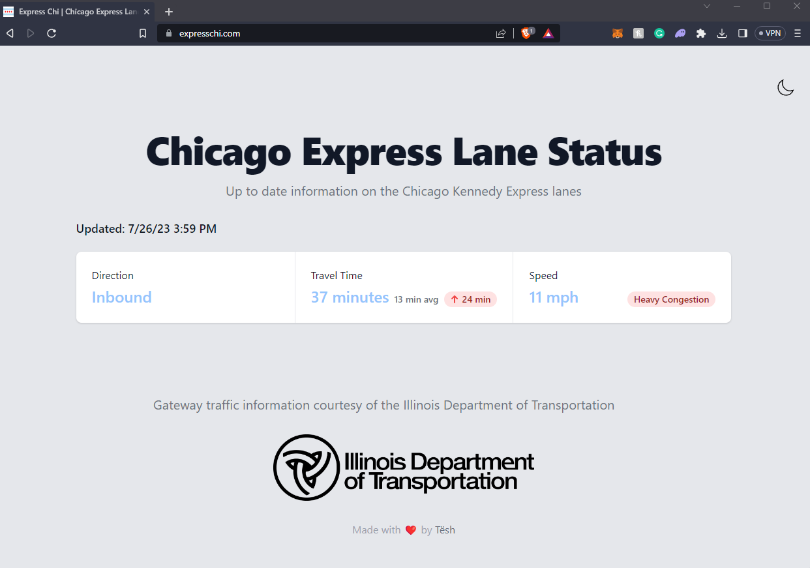

# Express Chi

View the status of the Chicago Kennedy express lanes
[expresschi.com](https://expresschi.com)

<p align="center">
  
  
</p>

## Usage

Make sure to install Deno:
<https://deno.land/manual/getting_started/installation>

Then start the project:

```
deno task dev
```

This will watch the project directory and restart as necessary.

## Built With

- [Deno](https://deno.land) - The easiest, most secure JavaScript runtime.
- [Typescript](https://www.typescriptlang.org/) - JavaScript with syntax for
  types.
- [Fresh](https://fresh.deno.dev) - The next-get web framework.
- [Preact](https://preactjs.com) - Fast 3kB alternative to React with the same
  modern API
- [Tailwind CSS](https://tailwindcss.com/) - A utility-first CSS framework for
  rapidly building custom designs.
- [Vite](https://vitejs.dev/) - The build tool for the web.
- [Deno Deploy](https://deno.com/deploy) - Serverless JavaScript hosting with
  zero config, worldwide.
- [IDOT](https://idot.illinois.gov/) - Gateway traffic information courtesy of
  the Illinois Department of Transportation

## Authors

- [Alex Matseshe](https://github.com/ajmhyd)

## Contributors

- [Albert Portnoy](https://github.com/asportnoy)

## License

[MIT](LICENSE)
